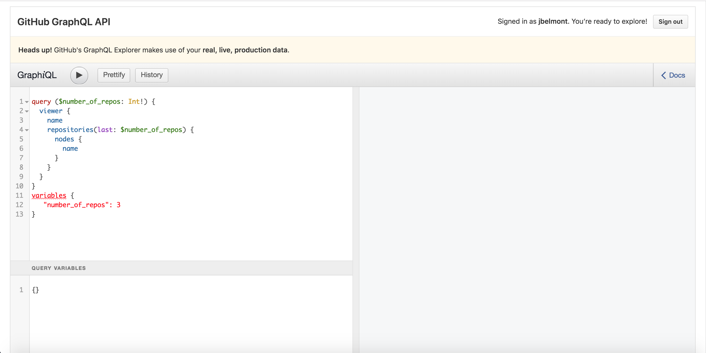
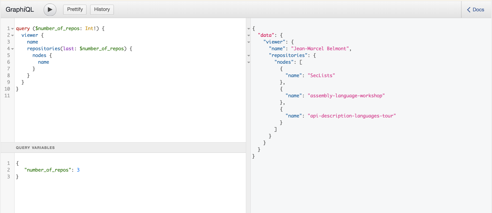

API Workshop - GraphQL

## Sections:

* [Introduction to GraphQL](#introduction-to-graphql)
* [GraphQL Schema Language](#graphql-schema-language)
* [GraphQL Query Language](#graphql-query-language)
* [GraphiQL](#graphiql)
* [Bread Crumb Navigation](#bread-crumb-navigation)

#### Introduction to GraphQL

###### What is GraphQL?

> GraphQL is a query language for your API, and a server-side runtime for executing queries by using a type system you define for your data. GraphQL isn't tied to any specific database or storage engine and is instead backed by your existing code and data.

#### GraphQL Schema Language

A GraphQL service is created by defining types and fields on those types, then providing functions for each field on each type. For example, a GraphQL service that tells us who the the hero is and his powers might look something like this:

###### Schema Example

```graphql
type Hero {
  id: ID!
  name: String
  powers: [String]
}
```

GraphQL allows us to define and describe our data structures. For this purpose, GraphQL provides a typed schema language . We specify custom types for the data served by the API. A GraphQL schema is created by defining types, which have a number of fields, and by providing access functions for each field and each type.

###### 2 Different Languages in GraphQL

* There is a query language and a schema definition language in GraphQL.

* These two languages have different purposes.

* The purpose of the schema definition language is to define the structure of the business data exposed by the GraphQL API. API providers use the schema definition language to specify the interface.

* The purpose of the query language is to interact with the GraphQL endpoint.

* Clients use the query language for reading data, writing data or subscribing to notifications.

* The schema serves as a constraint on the possible interactions.

###### Why is GraphQL have the Graph Part?

A graph is a very generic data structure and it should be possible to express the data of any application in the form of a graph, and so this graph which is formed by all application data, is what we call the graph in GraphQL.

###### Fields

> At its simplest, GraphQL is about asking for specific fields on objects. Let's start by looking at a very simple query and the result we get when we run it:

*GraphQL query:*

```graphql
{
  hero {
    name
    powers
    gender
  }
}
```

could return the following json payload:

```json
{
  "data": {
    "hero": {
      "name": "Superman",
      "powers": [
        "Superhuman Speed",
        "Superhuman Strength",
        "Superhuman Stamina",
        "Superhuman Durability",
        "Regenerative Healing Factor",
        "Immunity to All Diseases and Viruses"
      ],
      "gender": "male"
    }
  }
}
```

###### Arguments

In GraphQL you have the ability to pass in argument into fields.

> In a system like REST, you can only pass a single set of arguments - the query parameters and URL segments in your request. But in GraphQL, every field and nested object can get its own set of arguments, making GraphQL a complete replacement for making multiple API fetches. You can even pass arguments into scalar fields, to implement data transformations once on the server, instead of on every client separately.

```graphql
{
  hero(id: "2") {
    name
    powers
    gender
  }
}
```

would return the hero with an id of 2 which in this case would return this payload:

```json
{
  "data": {
    "hero": {
      "name": "Immortal Hulk",
      "superpowers": [
          "Superhuman Speed",
          "Superhuman Strength",
          "Transformation",
          "Self Sustenance",
          "Superhuman Stamina",
          "Superhuman Durability",
          "Regenerative Healing Factor",
          "Resistance to Psychic Control",
          "Immunity to All Diseases and Viruses",
          "Superhuman Leaping Ability",
          "Astral Form Perception",
          "Homing Ability",
          "Gamma Radiation/Energy Manipulation and Emission",
          "Adaptation to Hostile Environments",
          "Immortality"
      ],
      "gender": "male"
    }
  }
}
```

###### Aliases

Aliases in GraphQL let you rename the result of a field:

```graphql
{
  dcHero: hero(world: DC) {
    name
    powers
    gender
  }
  marvelHero: hero(world: MARVEL) {
    name
    powers
    gender
  }
}
```

so here we could get the following json payload with the following renamed fields:

```json
{
  "data": {
    "dcHero": {
      "name": "Superman",
      "powers": [
        "Superhuman Speed",
        "Superhuman Strength",
        "Superhuman Stamina",
        "Superhuman Durability",
        "Regenerative Healing Factor",
        "Immunity to All Diseases and Viruses"
      ],
      "gender": "male"
    },
    "marvelHero": {
      "name": "Immortal Hulk",
      "powers": [
        "Superhuman Speed",
          "Superhuman Strength",
          "Transformation",
          "Self Sustenance",
          "Superhuman Stamina",
          "Superhuman Durability",
          "Regenerative Healing Factor",
          "Resistance to Psychic Control",
          "Immunity to All Diseases and Viruses",
          "Superhuman Leaping Ability",
          "Astral Form Perception",
          "Homing Ability",
          "Gamma Radiation/Energy Manipulation and Emission",
          "Adaptation to Hostile Environments",
          "Immortality"
      ],
      "gender": "male"
    }
  }
}
```

###### Fragments

*In GraphQL fragments let you solve issues with duplication and grant code reuse.*

```graphql
{
  dcHero: hero(world: DC) {
    ...heroFields
  }
  marvelHero: hero(world: MARVEL) {
    ...heroFields
  }
}

fragment heroFields on Hero {
  name
  powers
  gender
}
```

###### Variables in Fragments

It is possible for fragments to use variables declared in query or mutation.

```graphql
query HeroComparison($first: Int = 3) {
  dcHero: hero(world: DC) {
    ...heroFields
  }
  marvelHero: hero(world: MARVEL) {
    ...heroFields
  }
}
fragment heroFields on Hero {
  name
  powers
  gender
  friendsConnection(first: $first) {
    totalCount
    edges {
      node {
        name
      }
    }
  }
}
```

Notice here how we reused the *$first* variable from the query

###### Operation Name

*We have been using the graphql shorthand syntax but it is better in production to use an operation name.*

> The operation type is either query, mutation, or subscription and describes what type of operation you're intending to do. The operation type is required unless you're using the query shorthand syntax, in which case you can't supply a name or variable definitions for your operation.

> The operation name is a meaningful and explicit name for your operation. It is only required in multi-operation documents, but its use is encouraged because it is very helpful for debugging and server-side logging. When something goes wrong either in your network logs or your GraphQL server, it is easier to identify a query in your codebase by name instead of trying to decipher the contents. Think of this just like a function name in your favorite programming language. For example, in JavaScript we can easily work only with anonymous functions, but when we give a function a name, it's easier to track it down, debug our code, and log when it's called. In the same way, GraphQL query and mutation names, along with fragment names, can be a useful debugging tool on the server side to identify different GraphQL requests.

Here is an example of a graphql *query* operation:

```graphql
query HeroNameAndFriends {
  hero {
    name
    powers
    gender
    friends {
      name
    }
  }
}
```

which would return the following json payload:

```json
{
  "data": {
    "hero": {
      "name": "Superman",
      "powers": [
        "Superhuman Speed",
        "Superhuman Strength",
        "Superhuman Stamina",
        "Superhuman Durability",
        "Regenerative Healing Factor",
        "Immunity to All Diseases and Viruses"
      ],
      "gender": "male",
      "friends": [
        {
          "name": "Batman"
        },
        {
          "name": "Han Solo"
        }
      ]
    }
  }
}
```

###### Variables

We need to 3 things to work with variables:

1. Replace the static value in the query with $variableName

2. Declare $variableName as one of the variables accepted by the query

3. Pass variableName: value in the separate, transport-specific (usually JSON) variables dictionary

Here is an example:

```graphql
query HeroNameAndFriends($organization: ComicOrganization) {
  hero(organization: $organization) {
    name
    friends {
      name
    }
  }
}

// Pass in value for $organization
{
  "organization": "DC"
}
```

Here is the corresponding response payload:

```json
{
  "data": {
    "hero": {
      "name": "Superman",
      "friends": [
        {
          "name": "Batman"
        },
        {
          "name": "Wonder Woman"
        }
      ]
    }
  }
}
```

###### Default Variables

*Default values can also be assigned to the variables in the query by adding the default value after the type declaration.*

```graphql
query HeroNameAndFriends($organization: ComicOrganization = DC) {
  hero(organization: $organization) {
    name
    friends {
      name
    }
  }
}
```

*Notice here that we passed in a default value of 'DC' for the $organization variable.*

###### Directives

> A directive can be attached to a field or fragment inclusion, and can affect execution of the query in any way the server desires. The core GraphQL specification includes exactly two directives, which must be supported by any spec-compliant GraphQL server implementation.

Here are the 2 directives:

* `@include(if: Boolean)` Only include this field in the result if the argument is true.

* `@skip(if: Boolean)` Skip this field if the argument is true.

Here is the query:

```graphql
query HeroNameAndFriends($organization: ComicOrganization = DC, $hasFriends: Boolean!) {
  hero(organization: $organization) {
    name
    friends @include(if: $hasfriends) {
      name
    }
  }
}
```

Here is an example of passing in variables:

```json
{
  "organization": "Marvel",
  "hasFriends": false
}
```

Here would be a possible payload:

```json
{
  "data": {
    "hero": {
      "name": "Deadpool"
    }
  }
}
```

###### Mutations

Mutations in GraphQL are used to update/create date.

Remember that in REST we would by convention use a GET Request to retrieve data.

In order to do a write operation in REST we can use a POST for creation, PUT for an update, and PATCH for a partial update.

You could in theory use a query to do a write operation but in GraphQL the most appropriate operation is a Mutation.

Let us create a new Hero by using a mutation:

```graphql
mutation CreateHero($organization: ComicOrganization!, $name: NAME, $powers: Abilities, $gender: GENDER) {
  createHero(organization: $organization, name: $name, powers: $powers, gender: $gender) {
    organization
    name
    powers
    gender
  }
}
```

Here would be the variables passed in:

```json
{
  "organization": "DC",
  "name": "Superman",
  "powers": [
    "Solar energy absorption",
    "Superhuman Strength",
    "Invulnerability",
    "Superhuman speed",
    "Flight",
    "Healing-factor",
    "Super-stamina, endurance, durability, agility and reflexes",
    "Super-senses",
    "Super-intelligence",
    "Super-memory",
    "Super-breath and Arctic breath",
    "Multilingualism",
    "Longevity",
    "Solar-Flare (New 52)",
    "Energy signals and transmissions awareness (New 52)",
  ],
  "gender": "male"
}
```

###### Inline Fragments

*If you are querying a field that returns an interface or a union type, you will need to use inline fragments to access data on the underlying concrete type.*

Here is an example:

```graphql
query HeroGroups($organization: Organization!) {
  heroGroups(organization: $organization) {
    name
    ... on DC {
      rating
      members
    }
    ... on Marvel {
      members
    }
  }
}
```

Here we pass the following json value for variable:

```json
{
  "organization": "DC"
}
```

Here is one possible json payload:

```json
{
  "data": {
    "hero": {
      "rating": 10,
      "members": [
        "Aquaman",
        "The Atom",
        "Aztek",
        "Batman",
        "Black Canary",
        "Booster Gold",
        "Captain Marvel",
        "Catwoman",
        "Crimson Fox",
        "Cyborg",
        "Doctor Fate",
        "The Elongated Man",
        "Firestorm",
        "The Flash",
        "Green Arrow",
        "Green Lantern (Hal Jordan)",
        "Green Lantern (John Stewart)",
        "Green Lantern (Kyle Rayner)",
        "Green Lantern (Simon Baz)",
        "Hawkgirl",
        "Hawkman",
        "Hawkwoman",
        "Huntress",
        "Killer Frost",
        "Lobo",
        "The Martian Manhunter",
        "Mera",
        "Metamorpho",
        "Mister Miracle",
        "Phantom Stranger",
        "Plastic Man",
        "The Ray",
        "Red Tornado",
        "Steel",
        "Supergirl",
        "Superman",
        "Shazam",
        "Vibe",
        "Vixen",
        "Wonder Woman",
        "Zatanna"
      ]
    }
  }
}
```

Notice that we passed in DC for the organization which has a list of members and a rating of 1 to 10 whereas Marvel just has members.

#### GraphQL Query Language

###### What is a GraphQL Query?

A GraphQL query consists of one ore more patterns and one method.

The patterns are matched against parts of the graph.

The method determines how the matched parts of the graph are processed.

The language provides methods for retrieving data, writing data and getting notified when the data changes.

###### Type System

add content here

###### Type Language

add content here

###### Object Types and Fields

add content here

###### Arguments

add content here

###### Query and Mutation Types

add content here

###### Scalar Types

add content here

###### Enumeration Types

add content here

###### Lists and Non-null

add content here

###### Interfaces

add content here

###### Union Types

add content here

###### Input Types

add content here

#### GraphiQL

For the workshop we will use Github's GraphiQL Explorer:



Notice in the screenshot below that we have a separate pane to put our variables for graphql:



Link to [Github V4 API](https://developer.github.com/v4/guides/forming-calls/#the-graphql-endpoint)

#### Bread Crumb Navigation
_________________________

Previous | Next
:------- | ---:
← [RAML](./raml.md) | [README](../README.md) →
