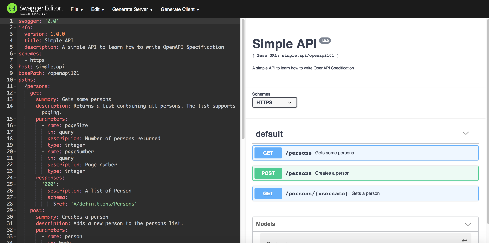
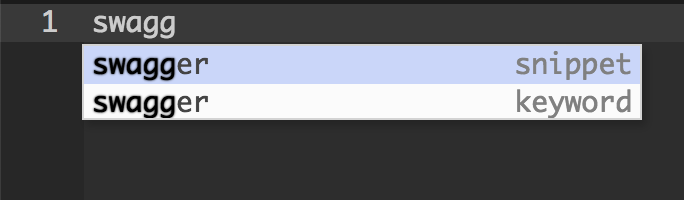
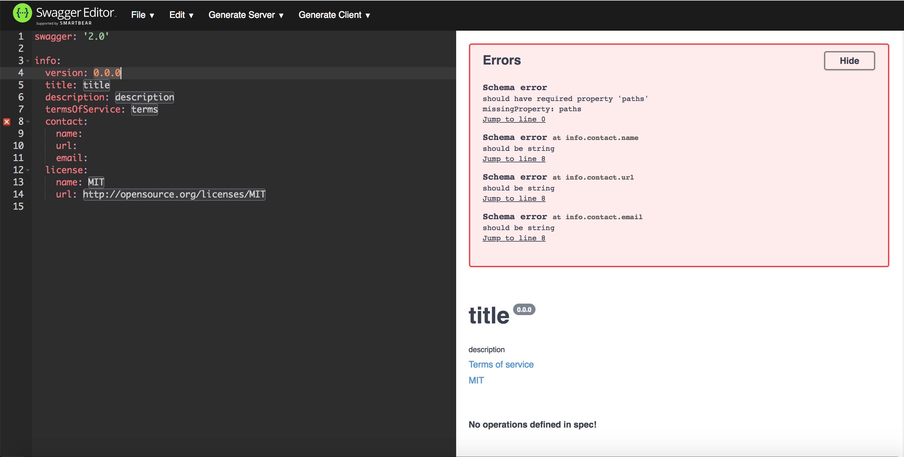
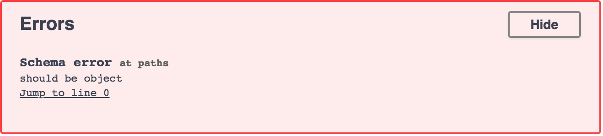
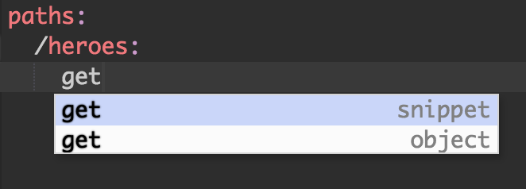
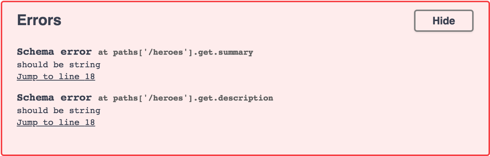
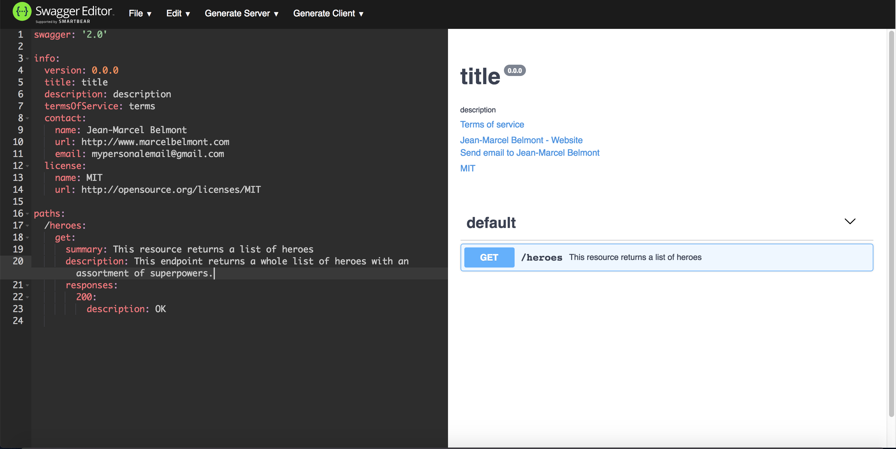
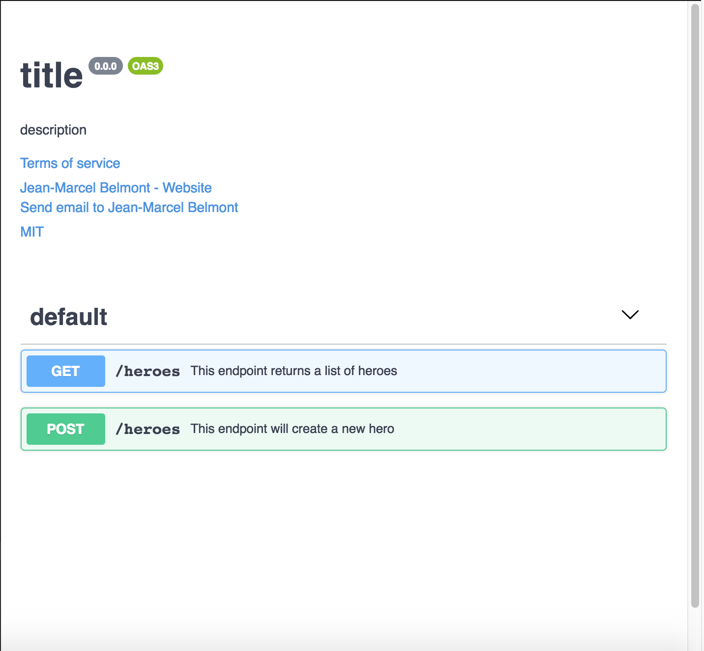
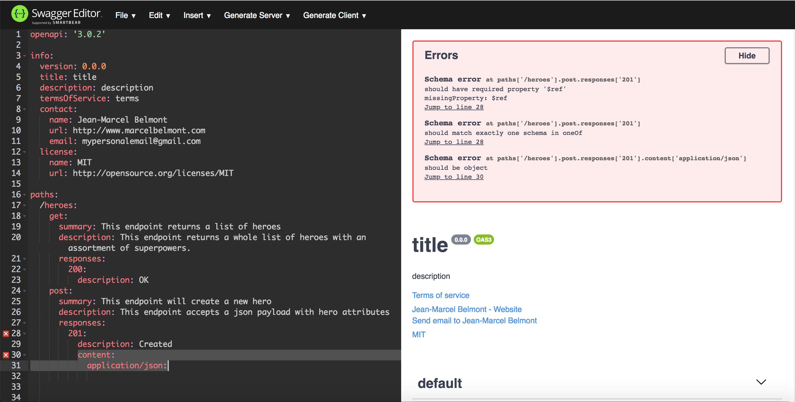
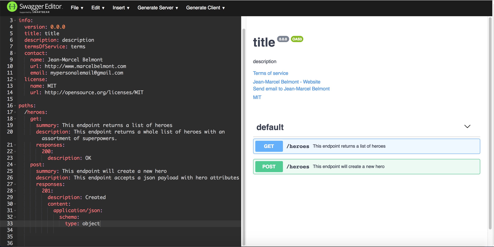

API Workshop - OpenAPI

## Sections:

* [What is OpenAPI](#what-is-openapi)
* [Difference between OpenAPI and Swagger](#difference-between-openapi-and-swagger)
* [Swagger Tools](#swagger-tools)
* [Swagger Editor Example](#swagger-editor-example)
* [Swagger Tutorial](#swagger-tutorial)
* [Bread Crumb Navigation](#bread-crumb-navigation)

#### What is OpenAPI

> The OpenAPI Specification (OAS) defines a standard, language-agnostic interface to RESTful APIs which allows both humans and computers to discover and understand the capabilities of the service without access to source code, documentation, or through network traffic inspection. When properly defined, a consumer can understand and interact with the remote service with a minimal amount of implementation logic.

> An OpenAPI definition can then be used by documentation generation tools to display the API, code generation tools to generate servers and clients in various programming languages, testing tools, and many other use cases.

#### Difference between OpenAPI and Swagger

[Swagger Blogpost](https://swagger.io/blog/api-strategy/difference-between-swagger-and-openapi/)

*OpenAPI is the official specification*

*Swagger are the combined tools for implementing the specification*

The OpenAPI is the official name of the specification.

The development of the specification is fostered by the OpenAPI Initiative, which involves more the 30 organizations from different areas of the tech world — including Microsoft, Google, IBM, and CapitalOne. Smartbear Software, which is the company that leads the development of the Swagger tools, is also a member of the OpenAPI Initiative, helping lead the evolution of the specification.

Swagger is the name associated with some of the most well-known, and widely used tools for implementing the OpenAPI specification. The Swagger toolset includes a mix of open source, free, and commercial tools, which can be used at different stages of the API lifecycle.

#### Swagger Tools

*List of Swagger Tools:*

* [Swagger Editor](https://editor.swagger.io/):
  * Swagger Editor lets you edit OpenAPI specifications in YAML inside your browser and to preview documentations in real time.

* [Swagger UI](https://swagger.io/tools/swagger-ui/):
  * Swagger UI is a collection of HTML, Javascript, and CSS assets that dynamically generate beautiful documentation from an OAS-compliant API.

* [Swagger Codegen](https://swagger.io/tools/swagger-codegen/):
  * Swagger Codegen allows generation of API client libraries (SDK generation), server stubs and documentation automatically given an OpenAPI Spec.

* [Swagger Parser](https://github.com/swagger-api/swagger-parser):
  * Swagger Parser is a standalone library for parsing OpenAPI definitions from Java
Swagger Core: Java-related libraries for creating, consuming, and working with OpenAPI definitions

* [Swagger Inspector (free)](https://inspector.swagger.io):
  * Swagger Inspector is an API testing tool that lets you validate your APIs & generate OpenAPI definitions from an existing API

* [SwaggerHub (free and commercial)](https://swagger.io/tools/swaggerhub/):
  * SwaggerHub is an API design and documentation tool, built for teams working with OpenAPI.

#### Swagger Editor

You can access the online swagger editor by going to [Swagger Editor](https://editor.swagger.io/).

*Here is a screenshot of the online editor:*



Here is the starting yaml:

```yml
swagger: '2.0'
info:
  version: 1.0.0
  title: Simple API
  description: A simple API to learn how to write OpenAPI Specification
schemes:
  - https
host: simple.api
basePath: /openapi101
paths:
  /persons:
    get:
      summary: Gets some persons
      description: Returns a list containing all persons. The list supports paging.
      parameters:
        - name: pageSize
          in: query
          description: Number of persons returned
          type: integer
        - name: pageNumber
          in: query
          description: Page number
          type: integer
      responses:
        '200':
          description: A list of Person
          schema:
            $ref: '#/definitions/Persons'
    post:
      summary: Creates a person
      description: Adds a new person to the persons list.
      parameters:
        - name: person
          in: body
          description: The person to create.
          schema:
            $ref: 'person.yaml#/Person'
      responses:
        '204':
          description: Persons succesfully created.
        '400':
          description: Persons couldn't have been created.
  '/persons/{username}':
    get:
      summary: Gets a person
      description: Returns a single person for its username.
      parameters:
        - name: username
          in: path
          required: true
          description: The person's username
          type: string
      responses:
        '200':
          description: A Person
          schema:
            $ref: 'person.yaml#/Person'
        '404':
          description: The Person does not exists.
definitions:
  Persons:
    type: array
    items:
      $ref: 'person.yaml#/Person'
```

#### Swagger Tutorial

Open the online [Swagger Editor](https://editor.swagger.io/) and remove the entries and start from scratch.

The first thing you need to specify is the swagger version:

Type swagger and you will get autocomplete in the editor.

You can choose either a snippet or a keyword:



Next choose to enter the *info* field and use the snippet:



Notice that we have multiple schema errors that the swagger editor is already reporting:

* Schema error
  * should have required property 'paths'
  * missingProperty: paths
  * Jump to line 0

* Schema error at info.contact.name
  * should be string
  * Jump to line 8

* Schema error at info.contact.url
  * should be string
  * Jump to line 8

* Schema error at info.contact.email
  * should be string
  * Jump to line 8

Let us fix this errors one by one now.

When we use the *info* snippet to prefill yaml fields the editor stubbed out fields for us but left the name, url, and email empty which is what is causing issues now:

```yml
info:
  version: 0.0.0
  title: title
  description: description
  termsOfService: terms
  contact:
    name: Jean-Marcel Belmont
    url: http://www.marcelbelmont.com
    email: mypersonalemail@gmail.com
  license:
    name: MIT
    url: http://opensource.org/licenses/MIT
```

Now notice that the editor is complaining about the following error:



Now enter a *paths* field and notice the new error:


Let enter a new resource of */heroes* and use the *get* snippet:



The *get* snippet then gives us the summary, description, and responses fields.

Now our *paths* block looks like this:

```yml
paths:
  /heroes:
    get:
      summary:
      description:
      responses:
        200:
          description: OK
```

Now we have the following errors reported by the swagger editor:



We can easily resolve these errors by adding values to the summary and description fields.

Now notice that the swagger editor is not complaining anymore:



Here is the complete yaml example that we currently have in the swagger editor:

```yml
swagger: '2.0'

info:
  version: 0.0.0
  title: title
  description: description
  termsOfService: terms
  contact:
    name: Jean-Marcel Belmont
    url: http://www.marcelbelmont.com
    email: mypersonalemail@gmail.com
  license:
    name: MIT
    url: http://opensource.org/licenses/MIT

paths:
  /heroes:
    get:
      summary: This resource returns a list of heroes
      description: This endpoint returns a whole list of heroes with an assortment of superpowers.
      responses:
        200:
          description: OK
```

*Notice that we specified the swagger, info, and paths fields as top level fields in the yaml file.*

#### OpenAPI Version 3 in Swagger Editor

You can use the current openapi version in the swagger editor which is what I would suggest anyways:

Let us update the swagger field from `swagger: 2.0` to `openapi: '3.0.2'`

Now in the screenshot below notice that the swagger editor added the label *OAS3* now:



###### OpenAPI Version 3 Specification

Please read through the [OpenAPI Specification at Github](https://github.com/OAI/OpenAPI-Specification/blob/master/versions/3.0.2.md) since there are differences between version 2 and version 3.

*If you try to use fields that are only available in version 2 of openapi but you specified version 3 you will get errors.*

Let us look at the fixed fields that you can use in the *response* object in the table:

| Field Name | Type |	Description |
| --- | --- | --- |
| description | string |	REQUIRED. A short description of the response. CommonMark syntax MAY be used for rich text representation. |
| headers |	Map&#91;string, Header Object &#124; Reference Object &#93; |	Maps a header name to its definition. RFC7230 states header names are case insensitive. If a response header is defined with the name "Content-Type", it SHALL be ignored. |
| content	| Map&#91;string, Media Type Object&#93; | A map containing descriptions of potential response payloads. The key is a media type or media type range and the value describes it. For responses that match multiple keys, only the most specific key is applicable. e.g. text/plain overrides text/* |
| links	| Map&#91;string, Link Object &#124; Reference Object&#93; | A map of operations links that can be followed from the response. The key of the map is a short name for the link, following the naming constraints of the names for Component Objects. |

* We want to use the *content* field name.*

We want to use a content-type of `application/json` for a POST `/heroes` route.

Now notice the new errors in the screenshot below:



Let us fix the errors one by one now:

Remember that we have specified a mime type of *application/json*

so we should provide a json request body and the fields we expect:

A superhero needs to have the following attributes:

* A name
* A list of superpowers
* A listed gender

*This will be our schema for creating a superhero*

###### Schema Object Section in OpenAPI Version 3

Please read [OpenAPI Version 3 Schema Object section](https://github.com/OAI/OpenAPI-Specification/blob/master/versions/3.0.2.md#schema-object)

We will have a type of object but please read through the [JSON Schema Specification](http://json-schema.org/)

###### JSON Scheam Draft Versions

There are currently multiple draft version of JSON Schema:

* [Latest Snapshot (work in progress)](http://json-schema.org/specification-links.html#latest-snapshot-work-in-progress)
* [Draft 7](http://json-schema.org/specification-links.html#draft-7)
* [Draft 6](http://json-schema.org/specification-links.html#draft-6)
* [Draft 5](http://json-schema.org/specification-links.html#draft-5)
* [Draft 4](http://json-schema.org/specification-links.html#draft-4)
* [Draft 3](http://json-schema.org/specification-links.html#draft-3)
* [Drafts 0/1/2](http://json-schema.org/specification-links.html#drafts-012)

###### JSON Schema Draft Version 0

Please read through the following html document for more details on [draft-wright-json-schema-00](https://tools.ietf.org/html/draft-wright-json-schema-00)

The JSON Schema instance can have the following 6 instances:

* null
  * A JSON "null" production

* boolean
  * A "true" or "false" value, from the JSON "true" or "false" productions

* object
  * An unordered set of properties mapping a string to an instance, from the JSON "object" production

* array
  * An ordered list of instances, from the JSON "array" production

* number
  * An arbitrary-precision, base-10 decimal number value, from the JSON "number" production
    string  A string of Unicode code points, from the JSON "string" production

#### Adding a schema type POST /heroes endpoint

Let us add a schema type of object to the heroes endpoint and notice that now the swagger editor is not complaining anymore:



#### Bread Crumb Navigation
_________________________

Previous | Next
:------- | ---:
← [API Description Languages](./api-description-languages.md) | [API Blueprint](./api-blueprint.md) →
